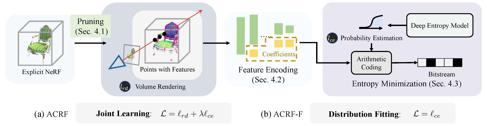

# ACRF: Compressing Explicit Neural Radiance Fields via Attribute Compression (ICLR 2024)

This is the official implementation of **ACRF**, a NeRF compression algorithm based on 3D compression techniques. For technical details, please refer to:

**ACRF: Compressing Explicit Neural Radiance Fields via Attribute Compression**  <br />
Guangchi Fang, Qingyong Hu, Longguang Wang, Yulan Guo.<br />
**[[Paper](https://openreview.net/pdf?id=POFrdKvpea)]** <br />

<p align="center">  </p>


### (1) Setup
This code has been tested with Python 3.7, torch 1.12.1, CUDA 11.6.

- Clone the repository 
```
git clone git@github.com:fatPeter/ACRF.git && cd ACRF
```
- Setup python environment
```
conda create -n ACRF python=3.7
conda activate ACRF
pip install -r requirements.txt
pip install torch==1.12.1+cu116 torchvision==0.13.1+cu116 -f https://download.pytorch.org/whl/torch_stable.html
pip install torch-scatter==2.1.0 -f https://data.pyg.org/whl/torch-1.12.1%2Bcu116.html
cd lib/cuda
python setup.py install
```


- Download datasets: [NeRF](https://drive.google.com/drive/folders/128yBriW1IG_3NJ5Rp7APSTZsJqdJdfc1), [T&T (masked)](https://dl.fbaipublicfiles.com/nsvf/dataset/TanksAndTemple.zip).

    <details>
        <summary> Directory structure (click to expand) </summary>

      
      data
      ├── nerf_synthetic     # Link: https://drive.google.com/drive/folders/128yBriW1IG_3NJ5Rp7APSTZsJqdJdfc1
      │   └── [chair|drums|ficus|hotdog|lego|materials|mic|ship]
      │       ├── [train|val|test]
      │       │   └── r_*.png
      │       └── transforms_[train|val|test].json
      │
      └── TanksAndTemple     # Link: https://dl.fbaipublicfiles.com/nsvf/dataset/TanksAndTemple.zip
          └── [Barn|Caterpillar|Family|Ignatius|Truck]
              ├── intrinsics.txt
              ├── rgb
              │   └── [0|1|2]_*.png
              └── pose
                  └── [0|1|2]_*.txt
          
     
    </details>

    For T&T, fix the intrinsics.txt of `Ignatius` following this [issue](https://github.com/sunset1995/DirectVoxGO/issues/4).


### (2) ACRF (full mode)

- Train, compress, decompress and eval scripts are in `./acrf`:
```
cd acrf
```
- Train, compress, decompress and eval on Synthetic-NeRF:
```
python scripts.py --dataset syn --lamda 1e-2
# lamda: 1e-2, 5e-3, 2e-3
```

- Train, compress, decompress and eval on Tanks&Temples:
```
python scripts.py --dataset tnt --lamda 1e-2
# lamda: 1e-2, 5e-3, 2e-3
```

### (3) ACRF-F (light mode)

- Train, compress, decompress and eval scripts are in `./acrf_f`:
```
cd acrf_f
```
- Train, compress, decompress and eval on Synthetic-NeRF:
```
python scripts.py --dataset syn --Qstep 0.5
# Qstep: 0.5, 1, 2
```

- Train, compress, decompress and eval on Tanks&Temples:
```
python scripts.py --dataset tnt --Qstep 0.5
# Qstep: 0.5, 1, 2
```


**Acknowledgement.** This repository is originally based on [VQRF](https://github.com/AlgoHunt/VQRF) and [3DAC](https://github.com/fatPeter/ThreeDAC).


<!-- ### Citation
If you find our work useful in your research, please consider citing:

    @article{fang20223dac,
      title={3DAC: Learning Attribute Compression for Point Clouds},
      author={Fang, Guangchi and Hu, Qingyong and Wang, Hanyun and Xu, Yiling and Guo, Yulan},
      journal={arXiv preprint arXiv:2203.09931},
      year={2022}
    }
 -->


